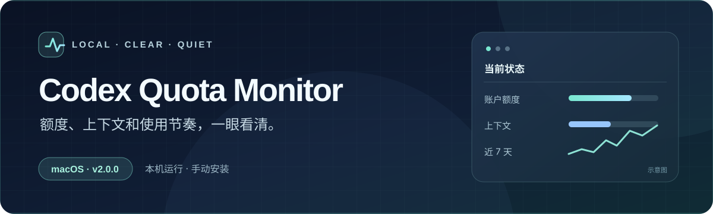

<div align="center">
  
</div>

<p align="center">
  <a href="https://github.com/ailble-abum/codex-quota-monitor/releases/tag/v2.0.8"><strong>下载 macOS 正式版</strong></a>
  &nbsp;·&nbsp;
  <a href="#快速开始">快速开始</a>
  &nbsp;·&nbsp;
  <a href="docs/RELEASE-v2.0.8.md">发行说明</a>
</p>

把 Codex 的账户额度、当前任务上下文和近 7 天的使用采样放在你看得见的地方：侧栏里有面板，菜单栏里有简要状态。数据主要在本机处理；不需要为这个项目再注册一个账号。

> 这是第三方工具，不是 OpenAI 官方插件。当前正式版面向 macOS；Windows 留到单独测试后再发布。

## 能看到什么

| 位置 | 内容 |
| --- | --- |
| Codex 侧栏 | 当前账户额度、重置时间、活动任务的上下文与健康提示；面板可切换单位、语言和伴宠。 |
| macOS 菜单栏 | 额度窗口、上下文及 Token 活动，点击可查看本地 7 天采样摘要并打开离线报告。 |
| 本地报告 | 按当前账户整理每日采样、常见模型和项目。它反映采样记录，不是完整账单或逐请求用量。 |
| 提醒与诊断 | 可选的额度通知；`doctor` 检查服务、配置和最近一次面板发布状态。 |

额度来自你本机已授权的 Codex CLI；任务数据来自本机 Codex 会话。历史与通知写在你指定的私有目录，不上传到本项目的服务器。V2 会定期检查 GitHub 正式发行，发现新版本时在面板自动提示；你也可点击“检测更新”。由 V2 LaunchAgent 管理的 macOS 安装可在确认后自动安装后续正式版。

## 快速开始

1. 从 [v2.0.8 发布页](https://github.com/ailble-abum/codex-quota-monitor/releases/tag/v2.0.8)下载 macOS ZIP 和 `SHA256SUMS`。在下载目录运行 `shasum -a 256 -c SHA256SUMS`，通过后解压到新目录。
2. 停止旧版监视器。进入解压后的目录，创建 Python 3.9+ 虚拟环境、安装依赖，复制并填写私有配置：

```sh
python3 -m venv .venv
.venv/bin/python -m pip install -r requirements-cdp.txt
cp config.example.json config.json
# 填写 Codex 页面地址、授权的会话目录和应用路径；菜单栏另需 history_root
```

3. 先在前台确认面板能显示，再按 Ctrl+C 停止，显式安装服务：

```sh
.venv/bin/python run.py --config "$PWD/config.json" --wait-for-host
.venv/bin/python -m quota_monitor.service install --config "$PWD/config.json"
.venv/bin/python -m quota_monitor.service doctor
.venv/bin/python -m quota_monitor.service menu-install --config "$PWD/config.json"
```

`doctor` 应报告 `service=running`、`config=valid`、`panel=updated`。包内 `RELEASE.txt` 说明了配置、菜单栏和回退顺序。升级时先在新目录验证，不要同时运行两个监视器。

从 v2.0.0、v2.0.1 或 v2.0.2 升级需先按上述步骤手动安装；这些版本没有可用的一键安装链。v2.0.3 起可在面板点“检测更新”，出现新正式版时选择“安装并重启”。自动更新保留旧目录和原 Python 虚拟环境，请勿立即删除旧目录。

## 现在的边界

- 安装仍需终端和手动配置；还没有一键安装器。ZIP 未签名或公证。
- 菜单栏程序包含 Apple Silicon 与 Intel 架构，真实界面验收目前只在 Apple Silicon Mac 上完成。
- 7 天报告是本地采样摘要。没有采到的时段不会补成“完整用量”；系统通知的实际弹出仍受 macOS 权限影响。
- V2 已替换本项目的运行链，但新猫“星瞳诺瓦”使用本项目新生成的图像，其余伴宠的来源和代码归因继续记录。发行包保留 Kevin Ke 与 Ailble 的 MIT `LICENSE` 和 `NOTICE`。

[发行说明](docs/RELEASE-v2.0.8.md) · [验证记录](docs/BETA-VALIDATION.md) · [资源来源](docs/asset-provenance.md)
