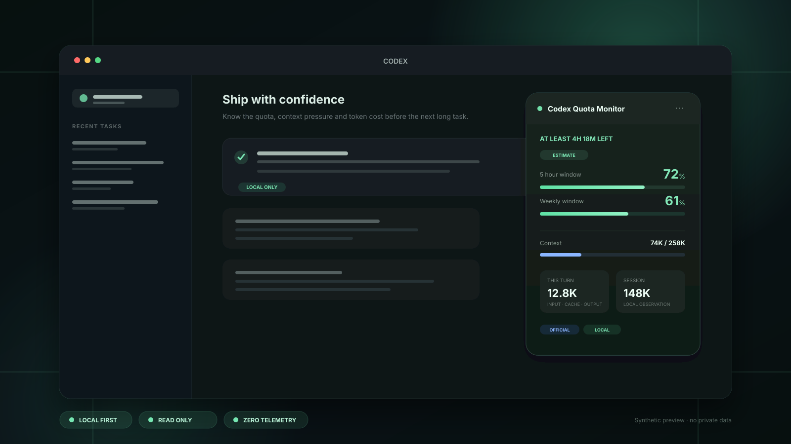
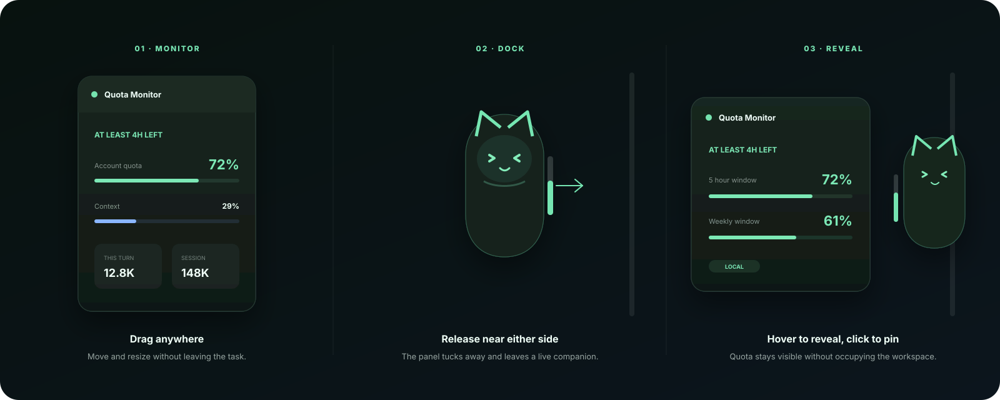

<p align="center">
  
</p>

<h1 align="center">Codex Quota Monitor</h1>

<p align="center">
  <strong>把 Codex 配额、上下文和 Token 压力，变成随时可见的工作仪表盘。</strong>
</p>

<p align="center">
  不再等到任务中途才发现额度见底，也不用靠感觉猜上下文还能撑多久。<br>
  本地运行、只读观测、零会话上传。
</p>

<p align="center">
  <a href="#安装"></a>
  <a href="LICENSE"></a>
  
</p>

<p align="center">
  <a href="#english">English</a> ·
  <a href="#一分钟认识它">产品预览</a> ·
  <a href="#安装">安装</a> ·
  <a href="#隐私边界">隐私</a> ·
  <a href="https://github.com/ailble-abum/codex-quota-monitor/issues">Issues</a>
</p>



> 预览图使用合成数据，不包含真实账户、会话、项目路径或认证信息。

## 一分钟认识它

Codex Quota Monitor 是一个面向 Codex 桌面端的本地只读监视器。它不只报一个百分比，而是回答真正有用的问题：

> **按现在的消耗速度，我还能稳定工作多久？**

配额窗口是「与」关系：任一窗口见底，账户就会停止服务，哪怕另一个还有余量。因此面板会结合实际消耗速度、重置时间和多窗口状态，给出「还能用多久」的时间预算。如果某个窗口会在耗尽前先重置，则显示「至少还能用」，避免制造一个假截止时间。

<table>
  <tr>
    <td width="25%"><strong>配额时间预算</strong><br><sub>结合剩余比例、重置时间和当前速度，比单个百分比更接近决策。</sub></td>
    <td width="25%"><strong>上下文压力</strong><br><sub>展示当前模型、推理强度、上下文占用和压缩事件。</sub></td>
    <td width="25%"><strong>Token 成本结构</strong><br><sub>分开本轮、会话、输入、缓存输入、输出与推理 Token。</sub></td>
    <td width="25%"><strong>可验证数据源</strong><br><sub>用微标明确区分官方账户、本地会话与线性估算。</sub></td>
  </tr>
</table>

> 本页所有界面数字均为合成演示数据；展示图不包含真实账户、会话或其他私密信息。

## 工作区的轻量级伴生层

面板不是另一个需要频繁切换的应用。它就在 Codex 工作区里：整体可拖动、四角可缩放，标题栏在长列表中保持固定。拖到屏幕左右边缘后，面板会软吸附并收起，只留下伴宠和账户配额计。



- 悬停伴宠：展开原面板。
- 移开鼠标：自动收起。
- 点击伴宠：固定展开。
- 拖动面板：脱离边缘，恢复自由悬浮。

### 六款角色伴宠

<table>
  <tr align="center">
    <td><br><sub>薄荷黑猫</sub></td>
    <td><br><sub>软糖女孩</sub></td>
    <td><br><sub>柯基助手</sub></td>
    <td><br><sub>薄荷萌男</sub></td>
    <td><br><sub>霜夜先生</sub></td>
    <td><br><sub>红茶御姐</sub></td>
  </tr>
</table>

伴宠旁边的配额计会为账户实际上报的每个配额窗口绘制一格。任一窗口触及上限时，整条配额计会转成停止态，而不是用「一格空、一格满」误导成「部分可用」。上下文压力使用环形提示，不与账户配额混为一个数字。

### 伴宠互动与提醒

- 六款伴宠使用更清晰的 320px 高素材；薄荷黑猫额外配有待机、开心、担心、提醒、等待、摸头六种表情。
- 头部按住 350ms 可摸头，身体拖动调整位置，单击仍固定展开。交互不会调用模型。
- 配额剩余 ≤20% / ≤10% / 耗尽时给出反馈，同账户、同窗口重置周期去重；恢复须由新读数确认。
- 当前聊天 CTX 70% 改变环提示，85% / 95% 给出轻提醒；数据是最近观测的请求输入占窗口比例，不是逐字实时读数，也不是官方压缩阈值。
- 切换聊天会清除旧提示；压缩按明确日志事件反馈，断连后过期数据转为未知。
- 设置可关闭伴宠动作与触碰、伴宠状态提示；系统减少动画会关闭运动效果，系统通知仍默认关闭。

## 你能看到什么

| 层级 | 内容 | 数据性质 |
| --- | --- | --- |
| 账户 | 动态配额窗口、剩余比例、重置倒计时、官方 Token 活动、可用重置额度 | Codex 本地 app-server 官方账户读数 |
| 当前任务 | 模型、推理强度、上下文占用、本轮和会话 Token、压缩事件 | 本地会话记录 |
| 判断 | 消耗速度、相对均匀进度、预计耗尽时间、交接提醒 | 明确标记的本地估算 |
| 趋势 | 本地 7 天周报、配额最低点、上下文峰值、缓存占比、模型/项目排名 | 本机数值摘要 |

面板提供迷你、标准、大字三种尺寸。位置、展开状态、数字单位、语言、伴宠和提醒设置都会保留。

## 安装

### 要求

- macOS 14 或更新版本
- 已安装并登录 ChatGPT/Codex 桌面端
- Python 3
- Xcode Command Line Tools（用于编译菜单栏组件）

### 1. 添加 GitHub 插件市场

```bash
codex plugin marketplace add https://github.com/ailble-abum/codex-quota-monitor --ref main
codex plugin add codex-quota-monitor@codex-quota-monitor
```

### 2. 安装本地监视服务

`codex plugin add` 会输出 `Installed plugin root`。进入该目录后运行：

```bash
python3 scripts/monitorctl.py install
```

### 3. 启动

重新打开一个 Codex 任务，输入：

```text
启动 Codex 用量监控
```

首次连接桌面窗口时，程序可能需要重启 ChatGPT/Codex，以启用仅监听 `127.0.0.1` 的本地调试端口。

## 常用命令

```bash
python3 scripts/monitorctl.py status          # 当前版本与运行状态
python3 scripts/monitorctl.py doctor          # 后台、菜单栏、桌面连接、账户额度诊断
python3 scripts/monitorctl.py show            # 显示或展开面板
python3 scripts/monitorctl.py reset-position  # 恢复默认位置
python3 scripts/monitorctl.py stop
python3 scripts/monitorctl.py start
```

`doctor` 会分别检查后台服务、菜单栏、桌面注入和账户额度。只看到进程存活，不代表面板已经成功进入当前 Codex 窗口。

## 数据流与信任边界

```text
Codex app-server ── 账户配额 / 官方 Token 活动 ─┐
                                                   ├── 本地整合 ── 桌面面板 / 菜单栏 / 离线周报
~/.codex/sessions ── 当前任务 / 上下文 / Token ─┘
```

- 配额来自 Codex 本地 app-server 的 `account/rateLimits/read`。
- 官方 Token 活动来自 `account/usage/read`。
- 当前会话统计来自 `~/.codex/sessions` 和 `~/.codex/archived_sessions` 中的本地 JSONL。
- 配额和 Token 是两套不同的数字；本项目不会把本地 Token 估算成账户剩余额度。
- 每天最多一次读取 GitHub 上公开的 `plugin.json` 以检查新版本；请求不携带本地版本、账户、会话或项目数据，失败时保持离线功能。

历史数据保存在 `~/Library/Application Support/CodexQuotaMonitor/`。其中只有数值摘要、简短项目文件夹名和生成的离线图表，不包含聊天正文、密钥或完整项目路径。

## 隐私边界

这个项目不会：

- 上传会话日志
- 修改 `Codex.app`、`ChatGPT.app` 或 `app.asar`
- 写入认证文件
- 自动切换账户
- 自动消耗重置额度
- 在未开启的情况下发送配额通知

低额度通知默认关闭。即使打开，同一账户、同一窗口、同一重置周期也只提醒一次。

## 平台状态

| 平台 | 状态 | 边界 |
| --- | --- | --- |
| macOS | **主力支持** | 桌面悬浮层、菜单栏、LaunchAgent 与本地历史工作流 |
| Windows | **实验性** | 仓库已包含适配器与托盘脚本，自动测试通过，但尚未完成 Windows 真机全链路验收 |

## 已知限制

- 桌面悬浮层依赖 CDP 和 Codex 当前 DOM，桌面应用升级后可能需要跟进选择器。
- 「预计耗尽时间」是按当前窗口平均速度做的线性投影，不是服务商保证。
- 账户和 CLI 登录不一致时，app-server 返回的是 CLI 当前账户数据。
- 项目排名最多统计最近 100 个本地会话，它不是账单明细。

## 开发与验证

```bash
python3 -m unittest discover -s plugins/codex-quota-monitor/scripts -p 'test_*.py' -v
swiftc -typecheck plugins/codex-quota-monitor/scripts/QuotaMenu.swift
```

更完整的实现细节和运维说明见 [插件技术文档](plugins/codex-quota-monitor/README.md)。提交问题时，请附上操作系统、Codex/ChatGPT 版本以及 `monitorctl.py doctor` 的输出，不要提交认证文件或完整会话日志。

## License & Credits

Codex Quota Monitor 由 **Ailble** 独立维护与持续扩展。项目采用 [MIT License](LICENSE)，并包含源自 [KevinKE93/Codex-Monitor](https://github.com/KevinKE93/Codex-Monitor) 的派生代码。上游版权与归因信息按许可要求保留在 [LICENSE](LICENSE) 和 [NOTICE](NOTICE) 中。

问题、Bug 与改进建议欢迎通过 [GitHub Issues](https://github.com/ailble-abum/codex-quota-monitor/issues) 提交，也可联系 [ailblechase@gmail.com](mailto:ailblechase@gmail.com)。

---

## English

**Codex Quota Monitor turns quota, context pressure, token usage and compaction state into an always-visible local dashboard inside the Codex desktop workspace.**

It focuses on the question a percentage alone cannot answer: *how long can the account keep working at its current pace?* The monitor combines the quota windows actually reported by the account with reset times and observed consumption. It clearly labels official account reads, local-session observations and estimates instead of blending them into one number.

Highlights:

- Dynamic account quota windows, reset countdowns and time-budget estimates
- Current context occupancy, model, reasoning effort and compaction events
- Turn/session input, cached input, output and reasoning Tokens
- Draggable and resizable overlay with Mini, Standard and Large presets
- Six illustrated companions with soft left/right edge docking
- macOS menu-bar status, local seven-day report and opt-in low-quota alerts
- Local, read-only operation with no session-log upload or authentication-file writes

Install:

```bash
codex plugin marketplace add https://github.com/ailble-abum/codex-quota-monitor --ref main
codex plugin add codex-quota-monitor@codex-quota-monitor
# Change into the "Installed plugin root" printed above.
python3 scripts/monitorctl.py install
```

Start a new Codex task and ask it to start Codex Quota Monitor. Run `python3 scripts/monitorctl.py doctor` from the installed plugin directory for diagnostics.

macOS is the primary platform. The repository includes a Windows adapter and tray component, but full real-machine acceptance is still pending.

Maintained and substantially extended by **Ailble**. MIT licensed. This project includes code derived from [KevinKE93/Codex-Monitor](https://github.com/KevinKE93/Codex-Monitor); required attribution is preserved in [LICENSE](LICENSE) and [NOTICE](NOTICE).
